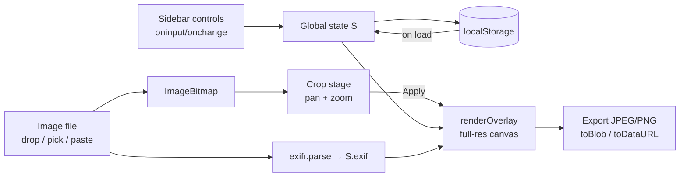

# Photo Overlay — EXIF · Technical Documentation

> Reference document for the current state of the codebase, written as a baseline
> before further feature expansion. Last updated: 2026-07-22.

---

## 1. What the project is

A **single-file, zero-build, browser-only tool** for photographers. It loads a
photo, extracts its EXIF metadata, lets the user crop it interactively, and
composites a stylized text overlay (camera settings, lighting notes, and
photographer credits) onto the image at **full source resolution**, then exports
it as JPEG or PNG.

There is no server, no framework, no bundler, and no `npm install`. The entire
application — CSS, HTML, and JavaScript — lives in one file:
`photo-overlay-app.html`. Opening it in a browser *is* deploying it.

### Repository layout

| Path | Purpose |
|---|---|
| `photo-overlay-app.html` | The entire application (~1,360 lines). |
| `README.md` | User-facing readme: features, usage, browser support. |
| `assets/` | Source SVG/PNG icons (icons8). **Not loaded at runtime** — the app uses base64-inlined copies (see §7). Kept as design sources. |
| `framedata-settings.json` | A sample settings export produced by the app itself. Not read by the app. |
| `framedata-settings.md` | Same, in Markdown form. |
| `docs/` | This documentation. |

### Runtime dependencies (all CDN)

| Dependency | Loaded from | Used for |
|---|---|---|
| **exifr v7.1.3** (UMD build) | `unpkg.com` | EXIF parsing (`window.exifr.parse`). Supports JPEG/TIFF/HEIC and RAW formats (ARW, CR3, NEF…). |
| **Google Fonts** — Syne, DM Mono, Montserrat, Instrument Serif | `fonts.googleapis.com` | UI chrome typography only. The *overlay text on the exported image* uses Helvetica Neue/Arial, not web fonts. |
| **Material Symbols Outlined** | `fonts.googleapis.com` | Declared in `<head>`; referenced in `renderOverlay` as a font constant but the rendered icons actually come from inlined SVGs (§7). |

Requires a network connection on first load; afterwards the browser cache makes
it work offline. Instrument Serif is loaded but not referenced by any CSS rule
(candidate for removal).

---

## 2. High-level architecture

The app is plain imperative JavaScript with **one global state object** and
direct DOM manipulation. There is no component system, router, or store — state
flows like this:



Every settings change (slider, checkbox, profile field, lighting notes) calls
`saveSettings()` (persist) and `renderOverlay()` (full re-render of the preview
canvas). Rendering is fast enough at typical camera resolutions that no
debouncing is done.

### The state object `S` (line ~555)

```js
const S = {
  imageFile: null,        // original File (used for export filename + EXIF)
  imageBitmap: null,      // decoded ImageBitmap (source of all drawing)
  cropRatio: '4:5',       // '4:5' | '1:1' | 'original'
  crop: { scale, offsetX, offsetY, outW, outH },   // see §5 for coordinate space
  cropApplied: false,     // gates renderOverlay()
  blur, darken,                                    // image effects
  marginPct, textWidthPct, vOffsetPct, hOffsetPct, // text position
  fontScale, lineHeight,                           // typography
  shadowEnabled, shadowBlur, shadowOpacity, shadowX, shadowY,
  exif: {},               // formatted strings, e.g. { aperture: 'f 1.8', ... }
  lightingNotes: '',      // current textarea contents (NOT persisted)
  presets: [],            // [{ name, text }] lighting-note presets (persisted)
  profile: { name, instagram, website },
};
```

A second tiny object `CV = { W, H }` holds the on-screen crop-viewport canvas
size in display pixels.

Some settings are read **directly from the DOM at render time** rather than
from `S`: the four show/hide checkboxes and the divider-opacity slider. Keep
this in mind when adding features — the app has two sources of truth (`S` and
the DOM), bridged by the mapping tables described in §8.

---

## 3. UI structure

```
<body>
├── <header>            logo · theme toggle · "↓ .json" / "↓ .md" settings export
├── .app-body
│   ├── .sidebar  (420px, fixed)
│   │   ├── tabs: Image | Overlay | Profile
│   │   ├── #tab-image    drop zone · aspect-ratio buttons · re-crop ·
│   │   │                 blur/darken sliders · EXIF readout grid
│   │   ├── #tab-overlay  lighting notes + presets · text position sliders ·
│   │   │                 typography sliders · drop-shadow controls
│   │   └── #tab-profile  name/instagram/website · show-hide checkboxes ·
│   │                     divider opacity
│   └── .canvas-area  (one of three mutually exclusive "stages")
│       ├── #empty-state      shown before any image is loaded
│       ├── #crop-stage       #crop-canvas + #crop-grid-canvas + zoom pill + actions
│       └── #preview-stage    canvas#preview (full-res, CSS-scaled) + re-crop button
├── .export-bar         Export PNG / Export JPEG
├── #global-drop-overlay  full-window "drop anywhere" veil
└── .toast              transient status messages
```

Stage switching is done by `showStage('crop' | 'preview')` toggling `.active`
classes; the empty state is hidden by inline style.

### Theming

Dark theme is the default, defined as CSS custom properties on `:root`; light
theme overrides them under `[data-theme="light"]`. `toggleTheme()` flips the
`data-theme` attribute on `<html>` and persists the choice to
`localStorage['framedata-theme']`. All UI colors go through the variables
(`--bg`, `--surface*`, `--border*`, `--text*`, `--accent*`), so new UI should
use them too. The gold accent `#c8a96e` is the brand color.

---

## 4. Image loading & EXIF pipeline

Three input paths all funnel into `loadImage(file)`:

1. **File picker / local drop zone** — `#file-input` change and drop events on `#drop-zone`.
2. **Full-window drag & drop** — `window`-level `dragenter/dragleave/drop` with a
   `dragCounter` to survive enter/leave events firing on child elements; shows
   `#global-drop-overlay` while dragging. Only files whose MIME type starts
   with `image/` are accepted on window drop.
3. **Clipboard paste** — `window` `paste` handler scans `clipboardData.items`
   for an image item.

`loadImage(file)` then:

1. `createImageBitmap(file)` → `S.imageBitmap` (the decode step; this is what
   limits supported formats to what the *browser* can decode — RAW files can
   have their EXIF read but will fail here).
2. `window.exifr.parse(file, { tiff, exif, translateKeys, translateValues,
   reviveValues })` — GPS/IPTC/XMP explicitly disabled.
3. `processExif(exif)` formats raw tags into display strings:

   | Field | Source tags | Formatter |
   |---|---|---|
   | Aperture | `FNumber` ∥ `ApertureValue` | `f 1.8` (1 decimal) |
   | Shutter | `ExposureTime` | `1/200s` for <1s, else `2s` |
   | ISO | `ISO` ∥ `ISOSpeedRatings` | `ISO 100` |
   | Focal | `FocalLength` | `85mm` (rounded) |
   | Camera | `Make` + `Model` | joined with space |
   | Lens | `LensModel` ∥ `Lens` | as-is |
   | Date/Time | `DateTimeOriginal` ∥ `DateTime` | `en-US` long date + 12h time |

   Missing values become `'—'`, and `'—'` values are filtered out of the
   rendered overlay (so absent EXIF simply drops rows).
4. UI: hides empty state, enables the re-crop button, and enters crop mode.

EXIF failure is non-fatal — the image still loads with all fields dashed.

---

## 5. The crop system (the trickiest part)

### Coordinate spaces

Three spaces are involved:

- **Source space** — pixels of the original `ImageBitmap` (`iw × ih`).
- **Scaled-image space** — source pixels multiplied by the zoom factor
  `S.crop.scale` (1–5). **`S.crop.offsetX/offsetY` live in this space**: they
  are the top-left corner of the crop window within the zoomed image.
- **Display space** — the on-screen viewport canvas, `CV.W × CV.H` pixels.

The crop *output* is always `outW × outH` **source-resolution** pixels,
computed by `getOutputDims()` from the aspect ratio:

- `'1:1'` → square of `min(iw, ih)`.
- `'4:5'` → widest 4:5 rectangle that fits inside the image.
- `'original'` → the full image (crop stage then only allows zooming in).

To convert the stored crop to source coordinates (used by both the viewport
preview and the final render — they share the exact same math, which is what
guarantees WYSIWYG):

```js
srcX = offsetX / scale;   srcW = outW / scale;
srcY = offsetY / scale;   srcH = outH / scale;
ctx.drawImage(bitmap, srcX, srcY, srcW, srcH, 0, 0, /* dest */ ...);
```

At `scale = 1` the crop window spans the full fitted region; zooming in shrinks
the source rectangle (`outW / scale`), magnifying the image.

### Interaction

`bindCropEvents()` wires up:

- **Mouse drag** to pan — converts display-pixel deltas to scaled-image pixels
  via the `CV.W / outW` ratio and updates offsets.
- **Wheel** to zoom in ±0.06 steps, clamped to `[1, 5]`.
- **Touch**: one-finger pan, two-finger pinch zoom (`pinchDist`/`pinchMid`).
- **`R` key** (bound globally at init) resets the transform.

Zooming is **cursor-anchored**: `applyZoomFactor()` solves for new offsets so
the point under the cursor/pinch-midpoint stays fixed. `clampOffset()` keeps
the crop window inside the zoomed image after every change.

Implementation notes worth knowing before touching this code:

- `bindCropEvents()` **clones and replaces** `#crop-canvas` to shed previously
  attached canvas listeners (it's called on every crop-mode entry). However,
  the `mousemove`/`mouseup` listeners it adds to `window` are *not* removed, so
  they accumulate one pair per crop-mode entry. Harmless today (a `drag` null
  guard makes stale listeners no-ops), but a real leak to fix if refactoring.
- `sizeCropCanvas()` fits the viewport into the canvas area (minus padding) at
  the crop aspect ratio; a window `resize` listener re-runs it live.
- Canceling a crop returns to the preview if a crop was previously applied,
  otherwise back to the empty state.
- Re-entering crop mode after applying **preserves** the previous transform
  (`if (!S.cropApplied) resetCropTransform()`), so "Adjust Crop" is
  non-destructive.

`applyCrop()` just sets `S.cropApplied = true`, switches to the preview stage,
and triggers the first `renderOverlay()` (after icon preload).

---

## 6. Overlay rendering (`renderOverlay`, line ~1058)

This is the heart of the app. It renders the **final deliverable** into
`canvas#preview` at full crop resolution (`outW × outH`); CSS merely scales it
to fit the window. Export reads this same canvas, so preview and export are
pixel-identical.

Render order:

1. **Cropped image** — same source-rect math as §5.
2. **Blur** — `ctx.filter = blur(Npx)` and the canvas is drawn *onto itself*
   (cheap full-frame blur, no offscreen buffer).
3. **Darken** — a black `rgba` fill at `darken/100` opacity.
4. **Text block**, vertically centered as a whole (see below).

### Typography scaling

Everything derives from one base unit proportional to image width, so the
overlay looks identical regardless of source resolution:

```js
bu  = outW * 0.028 * (fontScale / 100);
BIG = bu * 1.9;   // EXIF stat rows
MED = bu * 1.05;  // lighting notes
SM  = bu * 0.88;  // meta/credit rows
TI  = bu * 0.78;  // (computed but currently unused)
```

The overlay font is `bold 'Helvetica Neue', Arial, sans-serif` — deliberately a
system font so the export doesn't depend on web-font load state.

### Layout model

Horizontal: `mx` (left edge) = margin% of width **plus** the horizontal offset;
the right margin stays symmetric, and the text block width is `textWidthPct` of
the space between margins (this drives line wrapping only — lines are always
left-aligned at `mx`).

The block is assembled from three groups, all optional:

1. **Stats** — aperture, shutter, ISO, focal; each row = tinted icon + `BIG`
   text. Rows with missing EXIF are omitted entirely.
2. **Lighting notes** — free text, word-wrapped by `wrapText()` (greedy,
   `measureText`-based) to the text-block width.
3. **Meta** — a thin divider line (opacity from the Divider slider, width 68%
   of the text block), then rows for date/time, camera, lens, © name,
   Instagram, website — each gated by its checkbox and/or data presence.

Total height is pre-computed from the row counts, then the starting `y` is
`center + vOffset − totalH/2`, so the whole block stays visually centered as
content grows or shrinks.

### Drop shadow

When enabled, `ctx.shadow*` is applied to all text and icons, with blur and
offsets scaled by `outW / 1000` so the px sliders mean "px at ~1000px-wide
image". The shadow is temporarily cleared while stroking the divider line, then
re-applied.

---

## 7. Icon system

Runtime icons are **base64 `data:` URI SVGs** hard-coded in `ICON_URIS`
(aperture, shutter, iso, focal, datetime, camera, lens, copyright, instagram,
website). They originate from the icons8 files in `assets/` but are inlined so
the exported image never depends on external fetches.

- `preloadIcons(cb)` loads all of them into `Image` objects (`ICONS` map) and
  fires the callback when every load settles (errors count as settled);
  `applyCrop()` gates the first render on this.
- `drawIcon(ctx, key, x, y, size, alpha)` tints each icon **white** at draw
  time: it rasterizes the SVG to a per-call offscreen canvas, then uses
  `globalCompositeOperation = 'source-in'` to flood-fill with white, then draws
  that onto the main canvas at the given alpha. (A fresh offscreen canvas is
  created on every call — fine at current call counts, an easy micro-optimization
  if render frequency ever increases.)

---

## 8. Settings persistence

Three `localStorage` keys (naming is a leftover from an earlier working title,
"Frame & Data"):

| Key | Contents |
|---|---|
| `framedata-settings` | One JSON object: profile, crop ratio, all sliders, all checkboxes, divider opacity. |
| `framedata-presets` | Array of `{ name, text }` lighting presets. |
| `framedata-theme` | `'dark'` or `'light'`. |

Two declarative mapping tables keep state ↔ DOM ↔ storage in sync and are the
**single place to extend** when adding a new slider or checkbox:

- `SLIDER_KEYS` — `{ key, id, unit, valId }` per range input. Used by
  `loadFromStorage()` to restore both `S[key]` and the input/value-label DOM.
  Live updates go through the shared `updateSlider(key, el, unit)` handler
  (which also handles the shadow-panel enable/disable special case).
- `CHECKBOX_KEYS` — `{ key, id }` per checkbox. The shadow-enabled checkbox
  reuses `updateSlider` by passing a fake `{ value: 0|1 }` element.

`saveSettings()` serializes from a mix of `S` and direct DOM reads;
`loadFromStorage()` is called once on `DOMContentLoaded` and is fully
defensive (missing keys keep defaults, parse errors are swallowed with a
`console.warn`).

**Not persisted:** the loaded image, the crop transform, and the current
lighting-notes text (only *presets* survive a reload).

### Settings export

`exportSettings('json' | 'md')` builds a snapshot object (same shape as
`framedata-settings.json` in the repo root) and writes it via the same
save-dialog/download mechanism as image export. The Markdown variant is a
human-readable report (see `framedata-settings.md` for an example). Note there
is currently **no import** — the JSON export is one-way (listed as a planned
feature).

---

## 9. Image export

`exportImage(format)`:

1. Reads `canvas#preview` directly (already full resolution — no re-render).
2. Filename: `<original-basename>_overlay.jpg|png`.
3. **Chrome/Edge path:** File System Access API — `showSaveFilePicker` →
   `canvas.toBlob(mime, quality)` → writable stream. User cancel
   (`AbortError`) exits silently; any other failure falls through to:
4. **Fallback path (Firefox/Safari):** `canvas.toDataURL` + synthetic `<a
   download>` click.

JPEG quality is fixed at **0.93**; PNG is lossless.

---

## 10. Known quirks & cleanup candidates

Documented here so future work doesn't rediscover them:

1. **Window-listener accumulation** in `bindCropEvents()` (§5) — functional
   but leaky.
2. **Dual source of truth**: show/hide checkboxes and divider opacity are read
   from the DOM at render/save time instead of `S`. New code should pick one
   convention (preferably `S`) and migrate.
3. `loadFromStorage()` restores the active crop-ratio button by matching
   `b.dataset.ratio` — but the buttons define no `data-ratio` attribute, so it
   silently relies on the `textContent.includes(...)` fallbacks.
4. `TI` font size and the `ICON_FONT` Material-Symbols constant in
   `renderOverlay` are computed/declared but unused.
5. `assets/` icons and the Instrument Serif font are loaded/kept but unused at
   runtime.
6. Lighting-notes **text** isn't persisted (deliberate or not — worth deciding
   before adding more text fields).
7. `preset-name` HTML is built with template-string interpolation of preset
   text into `title="..."` — a preset containing `"` can break the attribute
   markup. Purely self-inflicted (local data), but worth sanitizing if
   settings import ever lands.
8. Branding drift: UI says "Photo Overlay — EXIF", storage keys and settings
   exports say "framedata".

---

## 11. Extension points (for upcoming feature work)

- **New slider or checkbox** → add the control HTML in the right sidebar
  section, a default in `S`, and one row in `SLIDER_KEYS` / `CHECKBOX_KEYS`;
  read it in `renderOverlay()` and (if exported) `exportSettings()`. That's
  the whole checklist.
- **New overlay content** (extra text fields, custom fonts) → extend the
  `stats` / `meta` arrays or add a new group in `renderOverlay()`; the
  centered-block layout adapts automatically via `totalH`.
- **Settings import** (planned in README) → the inverse of
  `exportSettings('json')`; `loadFromStorage()` already contains the
  restore-into-DOM logic to reuse — factor its body into an
  `applySettings(obj)` shared by both paths.
- **New aspect ratios** → one button + one branch in `getOutputDims()`;
  everything downstream is ratio-agnostic.
- **New export sizes** (e.g. Instagram-optimized) → render into an offscreen
  canvas at the target size instead of reading `#preview`; `renderOverlay`'s
  width-relative typography means it will scale correctly if parameterized by
  a target canvas.
- **Offline build** → inline the exifr UMD bundle and self-host/subset the
  fonts; icons are already inlined.

## 12. Planned features (from README)

- Custom font selection for overlay text
- Additional custom text fields beyond lighting notes
- Import settings from `.json`
- Multiple export size options (Instagram vs. full resolution)
- Fully offline / self-contained build
